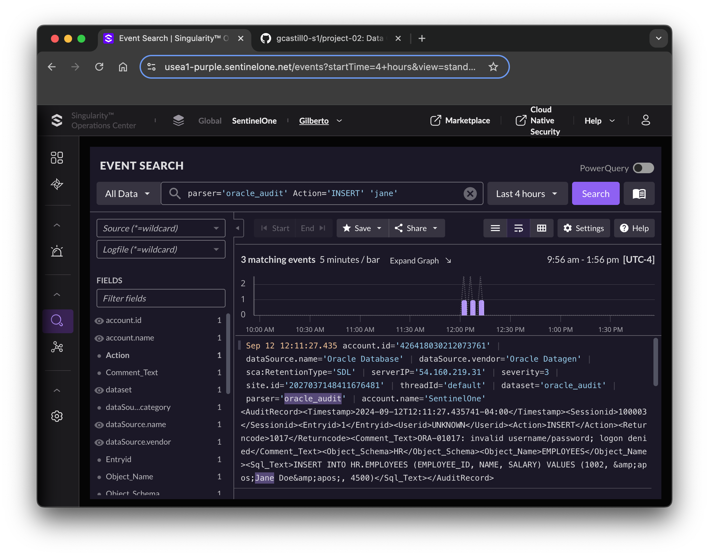

# Oracle Data Generator

The purpose of this project is to simulate Oracle Audit Events gathered from a sample set gathered from multiple public sources. The generator interprets an audit event and converts to either a JSON or XML encoded message.

For instance, we are given an audit record in the Oracle log as follows:

```bash
TIMESTAMP: "Wed Sep 11 14:23:19 2024 -04:00"
SESSIONID: "100001"
ENTRYID: "1"
USERID: "JDOE"
ACTION: "INSERT"
RETURNCODE: "0"
COMMENT$TEXT: "Authenticated by: DATABASE; INSERT successful."
OBJECT_SCHEMA: "HR"
OBJECT_NAME: "EMPLOYEES"
SQL_TEXT: "INSERT INTO HR.EMPLOYEES (EMPLOYEE_ID, NAME, SALARY) VALUES (1001, 'John Doe', 5000)"
```

The data generator reads the original item and formats the message as follows:

```xml
<AuditRecord>
    <Timestamp>2024-09-12T12:11:27.435741-04:00</Timestamp>
    <Sessionid>100001</Sessionid>
    <Entryid>1</Entryid>
    <Userid>JDOE</Userid>
    <Action>INSERT</Action>
    <Returncode>0</Returncode>
    <Comment_Text>Authenticated by: DATABASE; INSERT successful.</Comment_Text>
    <Object_Schema>HR</Object_Schema>
    <Object_Name>EMPLOYEES</Object_Name>
    <Sql_Text>INSERT INTO HR.EMPLOYEES (EMPLOYEE_ID, NAME, SALARY) VALUES (1001, &amp;apos;Jane Doe&amp;apos;, 5000)</Sql_Text>
</AuditRecord>
```

In the end, the data is sent to a SentinelOne raw ingestion API endpoint for processing. The intent is for the message to flow into the Singularity Data Lake and interpreted by the Singularity AI SIEM.



